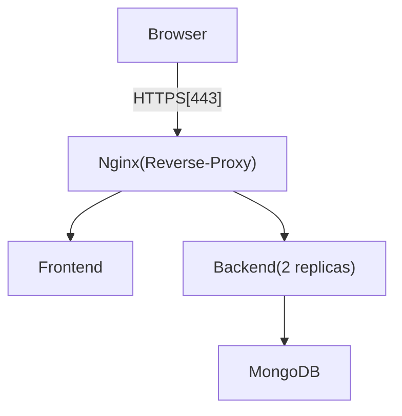

# Production Guide

### Project Stack:

* **Frontend**: React + Vite
* **Backend**: Node.js + Express
* **Database**: MongoDB
* **Reverse Proxy**: Nginx with HTTPS
* **Orchestration**: Docker Compose
* **Automation**: Bash deployment script

## Architecture Summary



### Key Properties

* Single entry point via Nginx
* Internal service-to-service communication over Docker bridge network
* No direct exposure of backend or database to host
* Stateless services except MongoDB (persistent volume)

## Docker Compose Files

### `docker-compose.prod.yml`

This file defines the **production-grade stack**, including:

* Explicit restart policies
* Health checks for all services
* Log rotation
* Named volumes for persistence
* Environment variables via `.env`
* HTTPS reverse proxy

## Environment Configuration

### `.env.example`

Contains placeholders for variables that neeed to be defined.

```.env.example
# Frontend Service
VITE_API_URL=<backend-endpoint>

# Backend Service
PORT=<port-number>
MONGO_URI=<mongo-uri>
ALLOWED_ORIGIN=<allowed-origin> 
```

## Networking Model

* All services are connected to a **single bridge network** (`d2`)
* Containers communicate using **service names** as DNS hosts
* Only Nginx exposes ports to the host

## Volumes & Persistence

### MongoDB Volumes

```yaml
volumes:
  mongo-data:
  mongo-config:
```

Mounted paths:

* `/data/db` → database files
* `/data/configdb` → Mongo internal config


## Health Checks

Health checks ensure that Docker can determine **service readiness**.

**Backend**

```yaml
healthcheck:
  test: ["CMD", "curl", "-f", "http://hv18:3000/health"]
```

**MongoDB**

```yaml
healthcheck:
  test: ["CMD", "mongosh", "--eval", "db.adminCommand('ping')"]
```

**Nginx**

```yaml
healthcheck:
  test: ["CMD", "curl", "-f", "http://hv18/"]
```

Health status is visible via:

```bash
docker ps
```

## Restart Policies

All services use:

```yaml
restart: unless-stopped
```

## Logging & Log Rotation

Docker’s `json-file` logging driver is used.

```yaml
logging:
  driver: "json-file"
  options:
    max-size: "10m"
    max-file: "3"
```
Logs can be viewed using:

```bash
docker logs
```

## Reverse Proxy & HTTPS

Nginx acts as:

* TLS terminator
* Static asset server (frontend)
* Load balancer for backend replicas

### Bind Mounts

```yaml
volumes:
  - ./nginx.conf:/etc/nginx/nginx.conf:ro
  - ./certs:/etc/nginx/ssl:ro
```

* Configuration and certificates are managed outside the container

## Deployment Automation

### `deploy-mode.sh`

This production deployment script does the following:

1. Verifies `.env` exists
2. Loads environment variables
3. Pulls base images
4. Builds application images
5. Starts the stack in detached mode
6. Displays service status